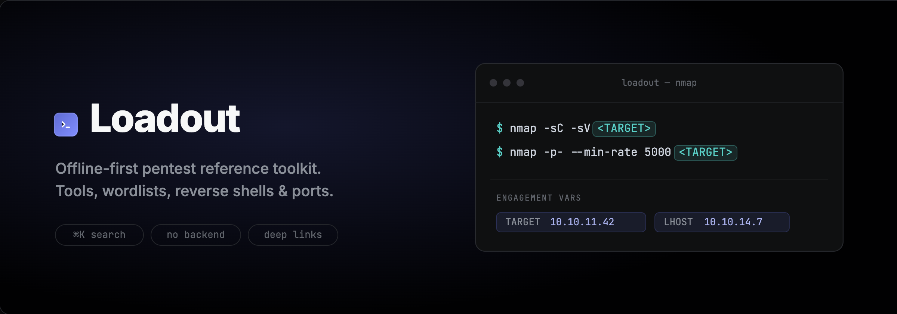

<div align="center">



An offline-first pentest reference toolkit for HTB-style boxes and CTFs — tool cheat sheets, wordlist guidance, reverse-shell payloads, and a ports/services reference, all in one fast, keyboard-driven app. Everything runs in the browser; state is kept in `localStorage` and there is no backend.

[](https://react.dev)
[](https://www.typescriptlang.org)
[](https://vite.dev)
[](https://tailwindcss.com)
[](#)
[](LICENSE)
[](https://jeremiah-blessing.github.io/loadout/)

</div>

## Features

- **Tools** — a browsable library of command cheat sheets (nmap, ffuf, gobuster, smbclient, sqlmap, hashcat, hydra, evil-winrm, and more), each with common usage, key parameters, more flags, and gotchas. Star your go-to tools to filter to favourites.
- **Engagement variables** — set `TARGET`, `LHOST`, `LPORT`, `WORDLIST` (plus your own custom vars) once; every `<TOKEN>` in every command resolves live, and one click copies the filled command. Click any token to jump straight to its editor.
- **Wordlist guide** — curated SecLists recommendations grouped by use case, with paths valid on both Kali and Parrot.
- **Reverse shells** — payload + matching listener generator with live variable substitution.
- **Ports & services** — quick reference of common ports, services, and the tools to throw at them.
- **Scratchpad** — a persistent notes drawer (⌘J) for loot, hashes, and findings.
- **Session timer** — track time on box and stamp user/root flags.
- **Command palette** (⌘K) — full-text search across tools, wordlists, and ports for instant navigation.
- **Dark / light theme**, deep-linkable URLs, and a layout that works offline.

## Development

```bash
npm install
npm run dev      # start the dev server
npm run build    # type-check (tsc -b) and build for production
npm run preview  # preview the production build
npm run lint     # lint the project
```

## Adding a tool

Tools are plain markdown-with-frontmatter files in `content/tools/`. Drop in a new `.md` file and it auto-loads — no code changes needed:

````markdown
---
slug: mytool
name: mytool
category: Recon
icon: scan          # optional; falls back to a category glyph
tags: [scan, discovery]
oneLiner: One-sentence description shown in lists and the palette.
---

## Common usage

Label for the command
```sh
mytool -flag <TARGET>
```

## Key parameters

| Flag | What it does |
| --- | --- |
| `-flag` | Explanation. |

## More flags

| Flag | What it does |
| --- | --- |
| `-v` | Verbose. |

## Gotchas & tips

- Things to watch out for.
````

Use `<TOKEN>` placeholders (e.g. `<TARGET>`, `<LHOST>`, `<WORDLIST>`) anywhere in commands to hook into live variable substitution. Reference data (wordlists, ports, reverse shells) lives in the JSON files under `content/`.

## Architecture

Source is organised feature-first under `src/`:

- `src/app/` — the shell: routing, layout chrome (sidebar, vars bar, command palette, session timer), and app-wide providers.
- `src/features/` — one folder per view: `tools`, `wordlists`, `ports`, `revshell`, `scratch`.
- `src/shared/` — cross-cutting `ui` primitives, composite `components`, `content` loading/parsing/search, `lib` (store, tokens, contexts), and `types`.

Routing is path-based via [wouter](https://github.com/molefrog/wouter) (real URLs like `/tool/nmap`), with a GitHub Pages SPA fallback (`public/404.html` + a decoder in `index.html`) so deep links and reloads survive on a static host. Interactive UI is built on [Radix primitives](https://www.radix-ui.com/) and [cmdk](https://cmdk.paco.me/).

See [CLAUDE.md](CLAUDE.md) for the full working guide.
